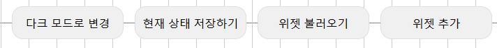
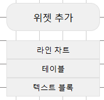
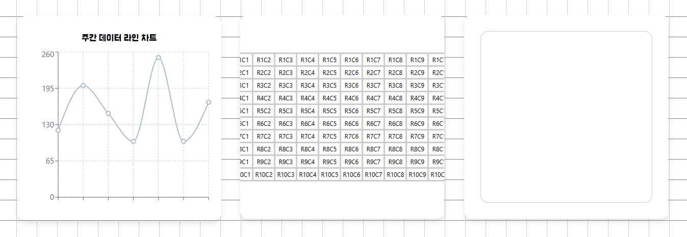
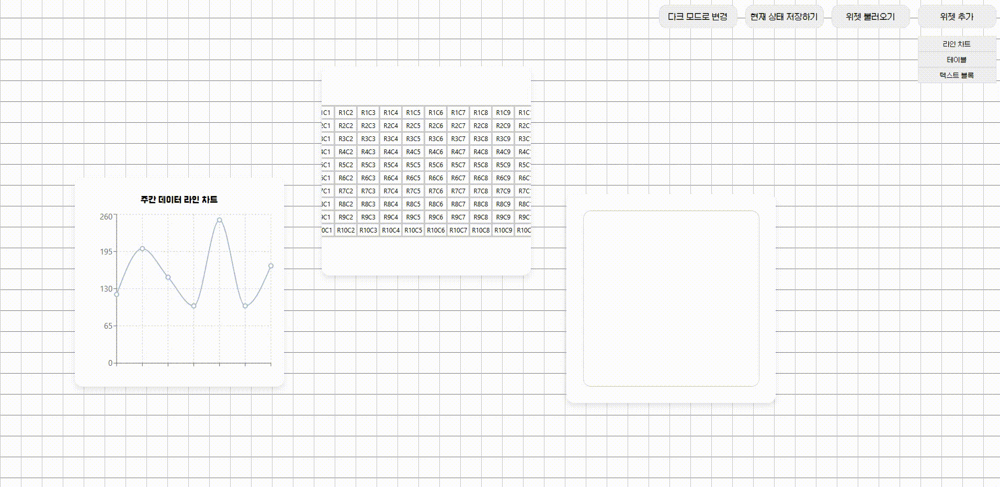
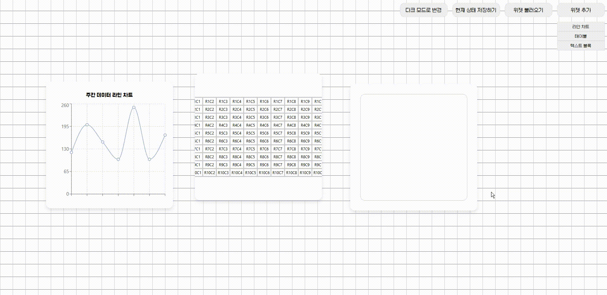
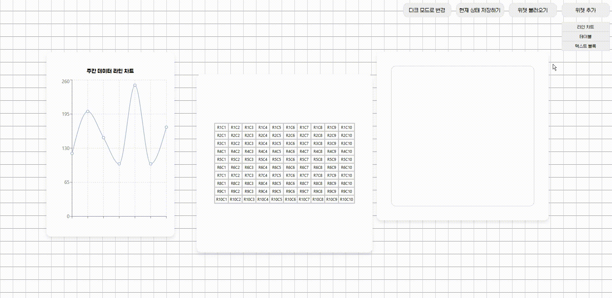
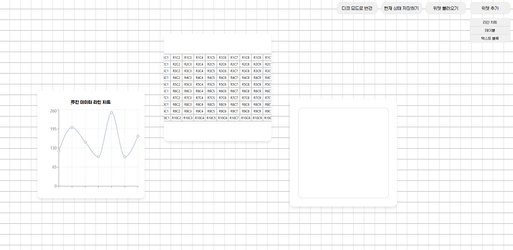
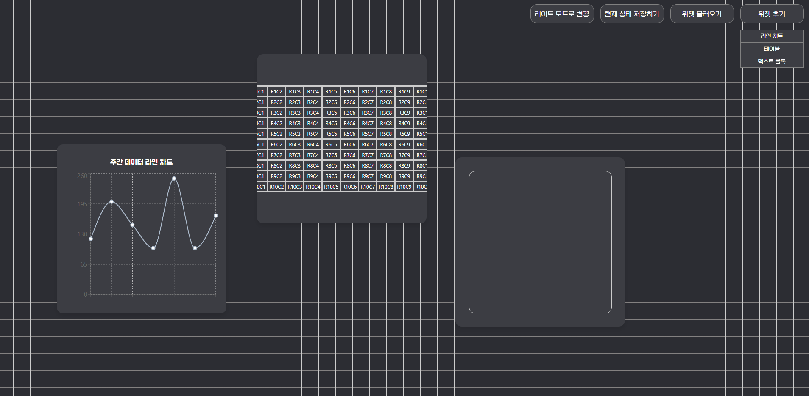

# 대시보드 빌더

목차는 아래와 같이 구성됩니다.

1. 기능 설명
2. 실행 방법

## 1. 기능 설명

버튼 박스에서 아래 기능을 제공하고 있습니다.


### 1) 위젯 추가

위젯 추가 버튼을 누르면 3가지 타입의 위젯을 선택할 수 있습니다.



왼쪽부터 라인 차트 위젯, 테이블 위젯, 텍스트 위젯입니다.

_라인 차트 위젯과 테이블 위젯에 더미 데이터를 넣어두었습니다._


### 2) 위젯 드래그 및 리사이징

각각의 위젯은 드래그와 리사이징 기능이 제공됩니다.

**드래그 앤 드롭**


**리사이징**


### 3) 위젯 저장/불러오기

위젯을 저장하고 불러올 수 있습니다.
IndexedDB에 JSON 형식으로 데이터를 저장하고 불러옵니다.



_영상은 저장 후에 웹페이지 새로고침을 했으며, 불러오기 버튼을 눌러 저장한 위젯을 불러옵니다._

### 4) 테마(라이트/다크) 변경

위젯의 테마 모드를 바꿀 수 있습니다. 라이트가 기본으로 설정되어 있으며, 버튼을 클릭해 다크모드로 전환할 수 있습니다.

| 라이트 모드                                      | 다크 모드                                      |
| ------------------------------------------------ | ---------------------------------------------- |
|  |  |

## 2. 실행 방법

1. ~/dashbaord-builder/ 경로로 이동합니다.
2. npm install을 입력하여 패키지를 다운 받습니다.

```bash
npm install
```

3. npm start을 입력하여 서버를 실행합니다.

```bash
npm start
```

4. http://localhost:3000에서 실행된 서버를 확인할 수 있습니다.
